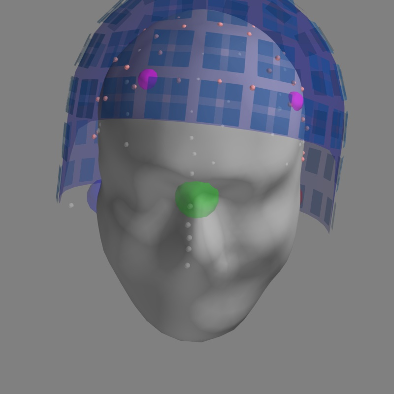
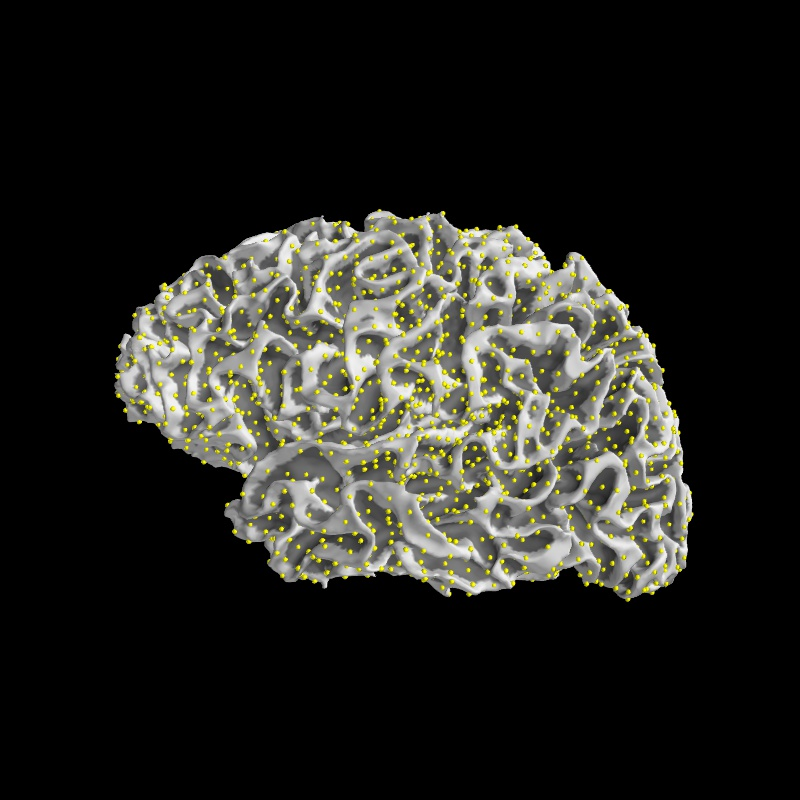
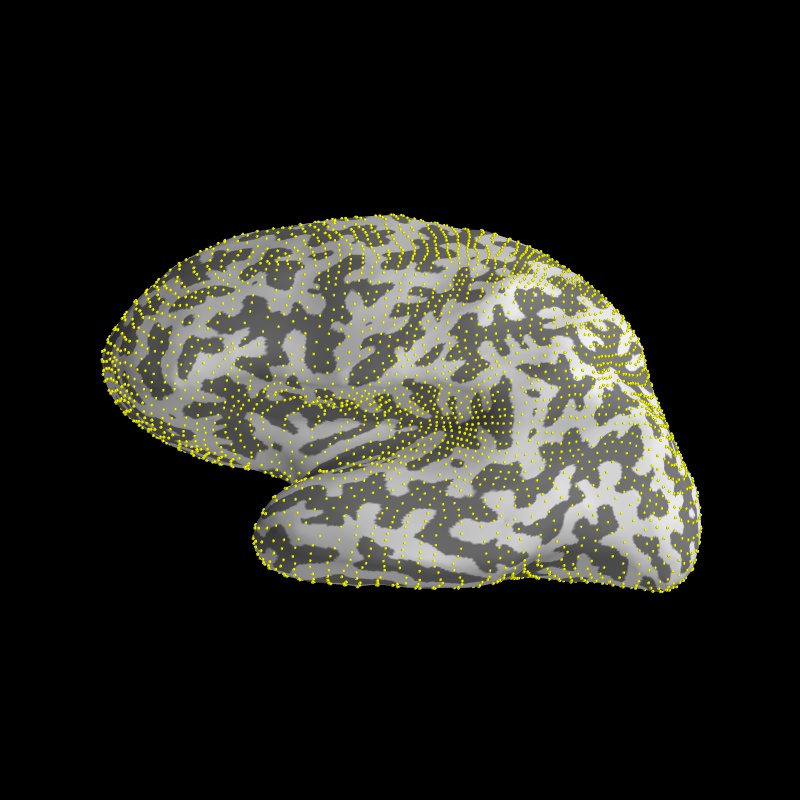
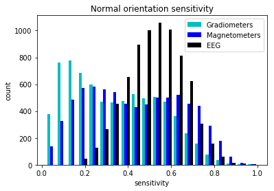
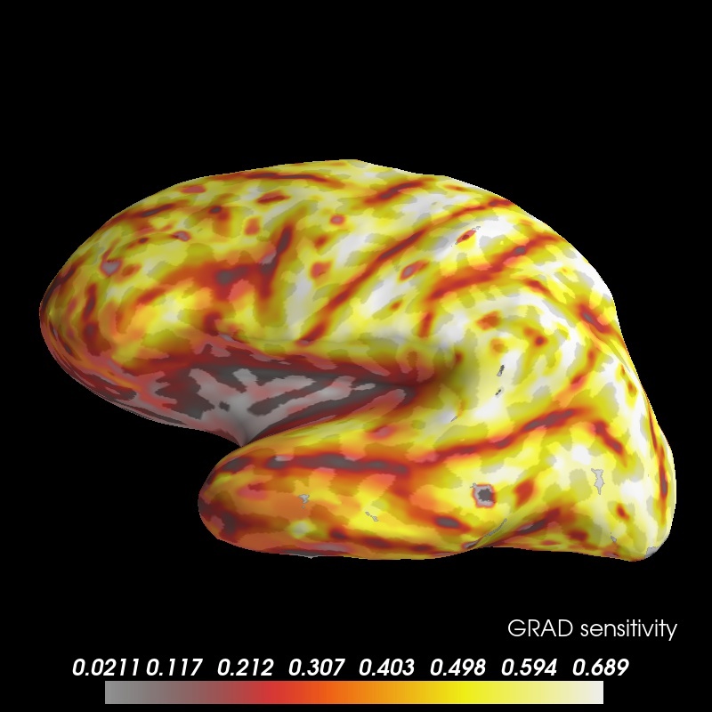
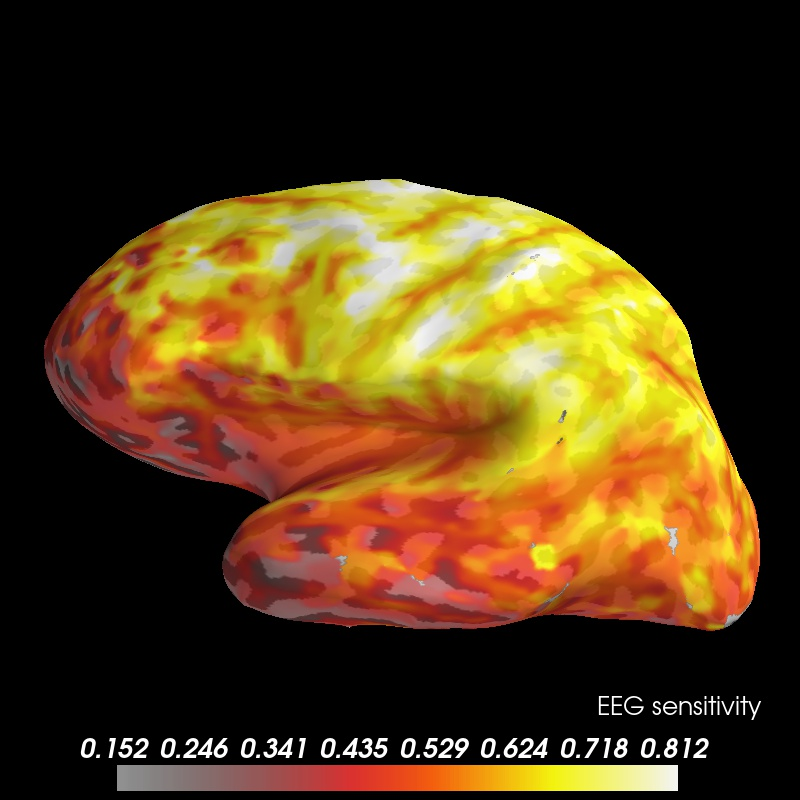
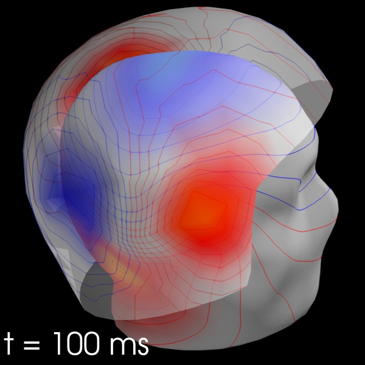

---
redirect_from:
  - "/evoked-to-stc/forward"
interact_link: content/evoked_to_stc/forward.ipynb
kernel_name: python3
has_widgets: false
title: 'Forward model'
prev_page:
  url: /evoked_to_stc/stc
  title: 'Source time course'
next_page:
  url: /evoked_to_stc/cov
  title: 'Covariance'
comment: "***PROGRAMMATICALLY GENERATED, DO NOT EDIT. SEE ORIGINAL FILES IN /content***"
---

# Forward computation

To compute source estimates, one typically assumes:
    
$$M = GX + E$$

where $M \in \mathbb{R}^{C \times T}$ is the sensor data, $G \in \mathbb{R}^{C \times S}$ is the lead-field matrix, $X \in \mathbb{R}^{S \times T}$ is the source time course (stc) and $E \in \mathbb{R}^{C \times T}$ is additive Gaussian noise

The lead-field matrix or forward operator $G$ is computed using the physics of the problem. It is what we will focus on here


{:.input_area}
```python
import matplotlib.pyplot as plt

from IPython.display import Image
from mayavi import mlab
mlab.init_notebook('png')
```


{:.output .output_stream}
```
Notebook initialized with png backend.

```

# Computing the forward operator

To compute a forward operator we need:

   - the BEM surfaces
   - a -trans.fif file that contains the coregistration info
   - a source space


{:.input_area}
```python
import mne
from mne.datasets import sample

data_path = sample.data_path()

# the raw file containing the channel location + types
raw_fname = data_path + '/MEG/sample/sample_audvis_raw.fif'

# The transformation file obtained by coregistration
trans = data_path + '/MEG/sample/sample_audvis_raw-trans.fif'
# The paths to freesurfer reconstructions
subjects_dir = data_path + '/subjects'
```


## Compute and visualize BEM surfaces

Computing the BEM surfaces requires FreeSurfer and makes use of either of the two following command line tools:

* [mne watershed_bem](http://martinos.org/mne/dev/generated/commands.html#mne-watershed-bem)
* [mne flash_bem](http://martinos.org/mne/dev/generated/commands.html#mne-flash-bem)

Here we'll assume it's already computed. It takes a few minutes per subject.

So first look at the BEM surfaces.

For EEG we use 3 layers (inner skull, outer skull, and skin) while for MEG 1 layer (inner skull) is enough.


{:.input_area}
```python
%matplotlib inline
mne.viz.plot_bem(subject='sample', subjects_dir=subjects_dir,
                 orientation='coronal');
```


{:.output .output_stream}
```
Using surface: /home/jovyan/mne_data/MNE-sample-data/subjects/sample/bem/inner_skull.surf
Using surface: /home/jovyan/mne_data/MNE-sample-data/subjects/sample/bem/outer_skull.surf
Using surface: /home/jovyan/mne_data/MNE-sample-data/subjects/sample/bem/outer_skin.surf

```


{:.output .output_png}


{:.input_area}
```python
# %%time

conductivity = (0.3,)  # for single layer
# conductivity = (0.3, 0.006, 0.3)  # for three layers
model = mne.make_bem_model(subject='sample', ico=4,
                           conductivity=conductivity,
                           subjects_dir=subjects_dir)
bem = mne.make_bem_solution(model)
```


{:.output .output_stream}
```
Creating the BEM geometry...
Going from 4th to 4th subdivision of an icosahedron (n_tri: 5120 -> 5120)
inner skull CM is   0.67 -10.01  44.26 mm
Surfaces passed the basic topology checks.
Complete.

Approximation method : Linear collocation

Homogeneous model surface loaded.
Computing the linear collocation solution...
    Matrix coefficients...
        inner_skull (2562) -> inner_skull (2562) ...
    Inverting the coefficient matrix...
Solution ready.
BEM geometry computations complete.

```

### Visualization the coregistration

The coregistration is operation that allows to position the head and the sensors in a common coordinate system. In the MNE software the transformation to align the head and the sensors is stored in a so called *trans* file. It is a FIF file that ends with `-trans.fif`. 

It can be obtained with 
* mne_analyze (Unix tools)
* mne.gui.coregistration (in Python), or
* mrilab if you're using a Neuromag system.

For the Python version see http://martinos.org/mne/dev/generated/mne.gui.coregistration.html

Here we assume the coregistration is done, so we just visually check the alignment with the following code.


{:.input_area}
```python
info = mne.io.read_info(raw_fname)
fig = mne.viz.plot_alignment(info, trans, subject='sample', dig=True,
                             subjects_dir=subjects_dir, verbose=True);
mlab.savefig('coreg.jpg')
Image(filename='coreg.jpg', width=500)
```


{:.output .output_stream}
```
    Read a total of 3 projection items:
        PCA-v1 (1 x 102)  idle
        PCA-v2 (1 x 102)  idle
        PCA-v3 (1 x 102)  idle
Using outer_skin.surf for head surface.
Getting helmet for system 306m

```





{:.input_area}
```python
mlab.close()
```


## Compute Source Space

The source space defines the position of the candidate source locations.

The following code compute such a source space with an OCT-6 resolution.


{:.input_area}
```python
mne.set_log_level('WARNING')
subject = 'sample'
src = mne.setup_source_space(subject, spacing='oct6',
                             subjects_dir=subjects_dir,
                             add_dist=False)
```


{:.input_area}
```python
src
```


{:.output .output_data_text}
```
<SourceSpaces: [<surface (lh), n_vertices=155407, n_used=4098, coordinate_frame=MRI (surface RAS)>, <surface (rh), n_vertices=156866, n_used=4098, coordinate_frame=MRI (surface RAS)>]>
```


src contains two parts, one for the left hemisphere (4098 locations) and one for the right hemisphere (4098 locations).

Let's write a few lines of mayavi to see what it contains


{:.input_area}
```python
import numpy as np
from surfer import Brain

brain = Brain('sample', 'lh', 'white', subjects_dir=subjects_dir)
surf = brain.geo['lh']

vertidx = np.where(src[0]['inuse'])[0]

mlab.points3d(surf.x[vertidx], surf.y[vertidx],
              surf.z[vertidx], color=(1, 1, 0), scale_factor=1.5)

mlab.savefig('source_space_subsampling.jpg')
Image(filename='source_space_subsampling.jpg', width=500)
```





Since it's hard to see the source points on the walls of the sulcus, it is common practice to inflate the white matter surface


{:.input_area}
```python
brain = Brain('sample', 'lh', 'inflated', subjects_dir=subjects_dir)
surf = brain.geo['lh']

mlab.points3d(surf.x[vertidx], surf.y[vertidx],
              surf.z[vertidx], color=(1, 1, 0), scale_factor=1.5)

mlab.savefig('source_space_subsampling.jpg')
Image(filename='source_space_subsampling.jpg', width=500)
```





{:.input_area}
```python
mlab.close()
```


### Compute forward solution

We can now compute the forward solution.

To reduce computation we'll just compute a single layer BEM
(just inner skull) that can then be used for MEG (not EEG).


{:.input_area}
```python
# Name of the forward to read (precomputed) or compute
fwd_fname = data_path + '/MEG/sample/sample_audvis-meg-eeg-oct-6-fwd.fif'
fwd = mne.make_forward_solution(raw_fname, trans=trans, src=src, bem=bem,
                                meg=True, # include MEG channels
                                eeg=False, # include EEG channels
                                mindist=5.0, # ignore sources <= 5mm from inner skull
                                n_jobs=1) # number of jobs to run in parallel
```


{:.input_area}
```python
fwd
```


{:.output .output_data_text}
```
<Forward | MEG channels: 306 | EEG channels: 0 | Source space: Surface with 7498 vertices | Source orientation: Free>
```


Or read the EEG/MEG file from disk


{:.input_area}
```python
fwd = mne.read_forward_solution(fwd_fname)
```


{:.input_area}
```python
fwd
```


{:.output .output_data_text}
```
<Forward | MEG channels: 306 | EEG channels: 60 | Source space: Surface with 7498 vertices | Source orientation: Free>
```


Convert to surface orientation for cortically constrained inverse modeling


{:.input_area}
```python
fwd = mne.convert_forward_solution(fwd, surf_ori=True)
leadfield = fwd['sol']['data']
print("Leadfield size : %d sensors x %d dipoles" % leadfield.shape)
```


{:.output .output_stream}
```
Leadfield size : 366 sensors x 22494 dipoles

```

# Sensitivy maps

Recall we had the gain matrix $G \in \mathbb{R}^{S \times C}$. 

A column in this matrix $g \in \mathbb{R}^{C}$ tells us how much each sensor is to a particular source

We can compute the sensitivity $a_s$ of the signals to each source point as:
    
$$a_s = \sqrt(g^{\top}g)$$


{:.input_area}
```python
grad_map = mne.sensitivity_map(fwd, ch_type='grad', mode='fixed')
mag_map = mne.sensitivity_map(fwd, ch_type='mag', mode='fixed')
eeg_map = mne.sensitivity_map(fwd, ch_type='eeg', mode='fixed')
```


{:.input_area}
```python
%matplotlib inline
plt.hist([grad_map.data.ravel(), mag_map.data.ravel(), eeg_map.data.ravel()],
          bins=20, label=['Gradiometers', 'Magnetometers', 'EEG'],
         color=['c', 'b', 'k'])
plt.legend()
plt.title('Normal orientation sensitivity')
plt.xlabel('sensitivity')
plt.ylabel('count');
```


{:.output .output_png}



{:.input_area}
```python
clim = dict(kind='percent', lims=(0.0, 50, 95), smoothing_steps=3)  # let's see single dipoles
brain = grad_map.plot(subject='sample', time_label='GRAD sensitivity', surface='inflated',
                      subjects_dir=subjects_dir, clim=clim, smoothing_steps=8, alpha=0.85);
view = 'lat'
brain.show_view(view)
brain.save_image('sensitivity_map_grad_%s.jpg' % view)
Image(filename='sensitivity_map_grad_%s.jpg' % view, width=400)
```





{:.input_area}
```python
clim = dict(kind='percent', lims=(0.0, 50, 99), smoothing_steps=3)  # let's see single dipoles
brain = eeg_map.plot(subject='sample', time_label='EEG sensitivity', surface='inflated',
                     subjects_dir=subjects_dir, clim=clim, smoothing_steps=8, alpha=0.9);
view = 'lat'
brain.show_view(view)
brain.save_image('sensitivity_map_eeg_%s.jpg' % view)
Image(filename='sensitivity_map_eeg_%s.jpg' % view, width=400)
```





{:.input_area}
```python
mlab.close()
```


# Visualizing field lines based on coregistration


{:.input_area}
```python
from mne import read_evokeds
from mne.datasets import sample
from mne import make_field_map

data_path = sample.data_path()

raw_fname = data_path + '/MEG/sample/sample_audvis_filt-0-40_raw.fif'

subjects_dir = data_path + '/subjects'
evoked_fname = data_path + '/MEG/sample/sample_audvis-ave.fif'
trans_fname = data_path + '/MEG/sample/sample_audvis_raw-trans.fif'
```


{:.input_area}
```python
make_field_map?
```


{:.output .output_data_text}
```
Signature:
make_field_map(
    evoked,
    trans='auto',
    subject=None,
    subjects_dir=None,
    ch_type=None,
    mode='fast',
    meg_surf='helmet',
    origin=(0.0, 0.0, 0.04),
    n_jobs=1,
    verbose=None,
)
Docstring:
Compute surface maps used for field display in 3D.

Parameters
----------
evoked : Evoked | Epochs | Raw
    The measurement file. Need to have info attribute.
trans : str | 'auto' | None
    The full path to the `*-trans.fif` file produced during
    coregistration. If present or found using 'auto'
    the maps will be in MRI coordinates.
    If None, map for EEG data will not be available.
subject : str | None
    The subject name corresponding to FreeSurfer environment
    variable SUBJECT. If None, map for EEG data will not be available.
subjects_dir : str
    The path to the freesurfer subjects reconstructions.
    It corresponds to Freesurfer environment variable SUBJECTS_DIR.
ch_type : None | 'eeg' | 'meg'
    If None, a map for each available channel type will be returned.
    Else only the specified type will be used.
mode : str
    Either `'accurate'` or `'fast'`, determines the quality of the
    Legendre polynomial expansion used. `'fast'` should be sufficient
    for most applications.
meg_surf : str
    Should be ``'helmet'`` or ``'head'`` to specify in which surface
    to compute the MEG field map. The default value is ``'helmet'``
origin : array-like, shape (3,) | str
    Origin of the sphere in the head coordinate frame and in meters.
    Can be ``'auto'``, which means a head-digitization-based origin
    fit. Default is ``(0., 0., 0.04)``.

    .. versionadded:: 0.11
n_jobs : int
    The number of jobs to run in parallel.
verbose : bool, str, int, or None
    If not None, override default verbose level (see :func:`mne.verbose`
    and :ref:`Logging documentation <tut_logging>` for more).

Returns
-------
surf_maps : list
    The surface maps to be used for field plots. The list contains
    separate ones for MEG and EEG (if both MEG and EEG are present).
File:      /opt/conda/lib/python3.7/site-packages/mne/forward/_field_interpolation.py
Type:      function

```


{:.input_area}
```python
# If trans_fname is set to None then only MEG estimates can be visualized

condition = 'Left Auditory'
evoked_fname = data_path + '/MEG/sample/sample_audvis-ave.fif'
evoked = mne.read_evokeds(evoked_fname, condition=condition, baseline=(-0.2, 0.0))

# Compute the field maps to project MEG and EEG data to MEG helmet
# and scalp surface
maps = mne.make_field_map(evoked, trans=trans, subject='sample',
                      subjects_dir=subjects_dir, n_jobs=1)

# explore several points in time
field_map = evoked.plot_field(maps, time=.1);
```


{:.input_area}
```python
from mayavi import mlab
mlab.savefig('field_map.jpg')
from IPython.display import Image
Image(filename='field_map.jpg', width=800)
```





{:.input_area}
```python
mlab.close()
```


## Exercise

Plot the sensitivity maps for EEG and compare it with the MEG, can you justify the claims that:

- MEG is not sensitive to radial sources
- EEG is more sensitive to deep sources

How will the MEG sensitivity maps and histograms change if you use a free instead if a fixed orientation?

Try this changing the `mode` parameter in `mne.sensitivity_map` accordingly.

Why don't we see any dipoles on the gyri?
